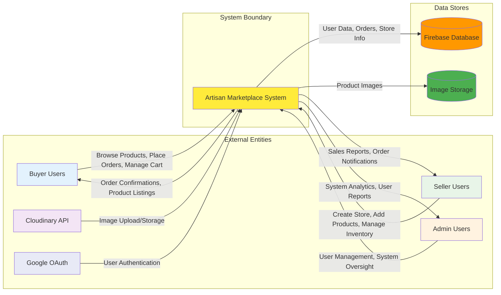

# Data Flow Diagram (DFD) - Level 0 - Artisan Marketplace

## Level 0 DFD Description:

### **External Entities:**
- **Buyer Users**: End consumers who browse products, manage shopping carts, and place orders
- **Seller Users**: Store owners who create stores, add products, and manage inventory
- **Admin Users**: System administrators who oversee user management and system operations
- **Cloudinary API**: External image hosting and CDN service
- **Google OAuth**: External authentication service provider

### **System Process:**
- **Artisan Marketplace System**: The main application that processes all business logic, manages data, and coordinates between different user roles

### **Data Stores:**
- **Firebase Database**: Primary data storage for users, stores, products, orders, and cart information
- **Image Storage**: Cloudinary-based storage for product images and media files

### **Data Flows:**
- **Input Flows**: User actions, authentication requests, image uploads
- **Output Flows**: Product listings, order confirmations, sales reports, system analytics
- **Storage Flows**: Data persistence and retrieval operations

