# Data Flow Diagram (DFD) - Level 1 - Artisan Marketplace

```mermaid
graph TB
    subgraph "External Entities"
        Buyer[Buyer Users]
        Seller[Seller Users]
        Admin[Admin Users]
        Cloudinary[Cloudinary API]
        Google[Google OAuth]
    end
    
    subgraph "Authentication & User Management"
        Auth[1.0 User Authentication]
        UserMgmt[1.1 User Management]
        RoleMgmt[1.2 Role Management]
    end
    
    subgraph "Store & Product Management"
        StoreMgmt[2.0 Store Management]
        ProductMgmt[2.1 Product Management]
        InventoryMgmt[2.2 Inventory Management]
    end
    
    subgraph "Shopping & Order Processing"
        ProductBrowse[3.0 Product Browsing]
        CartMgmt[3.1 Cart Management]
        OrderProc[3.2 Order Processing]
        PaymentProc[3.3 Payment Processing]
    end
    
    subgraph "Admin & Analytics"
        AdminOps[4.0 Admin Operations]
        Analytics[4.1 Analytics & Reporting]
        Moderation[4.2 Content Moderation]
    end
    
    subgraph "Data Stores"
        Users[(Users Collection)]
        Stores[(Stores Collection)]
        Products[(Products Collection)]
        Orders[(Orders Collection)]
        CartItems[(Cart Items)]
        Images[(Image Storage)]
    end
    
    %% External to System Flows
    Buyer -->|Browse, Purchase| ProductBrowse
    Buyer -->|Cart Operations| CartMgmt
    Seller -->|Store Operations| StoreMgmt
    Seller -->|Product Operations| ProductMgmt
    Admin -->|System Management| AdminOps
    Google -->|Auth Tokens| Auth
    Cloudinary -->|Image URLs| Images
    
    %% Authentication Flows
    Auth -->|User Credentials| Users
    Auth -->|Role Info| RoleMgmt
    RoleMgmt -->|User Roles| Users
    
    %% Store Management Flows
    StoreMgmt -->|Store Data| Stores
    StoreMgmt -->|Owner Info| Users
    
    %% Product Management Flows
    ProductMgmt -->|Product Data| Products
    ProductMgmt -->|Store Reference| Stores
    ProductMgmt -->|Image Upload| Cloudinary
    ProductMgmt -->|Image URLs| Images
    
    %% Inventory Management Flows
    InventoryMgmt -->|Stock Updates| Products
    InventoryMgmt -->|Inventory Data| Products
    
    %% Shopping Flows
    ProductBrowse -->|Product Queries| Products
    ProductBrowse -->|Store Info| Stores
    CartMgmt -->|Cart Operations| CartItems
    CartMgmt -->|Product Info| Products
    CartMgmt -->|User Reference| Users
    
    %% Order Processing Flows
    OrderProc -->|Order Creation| Orders
    OrderProc -->|Stock Deduction| Products
    OrderProc -->|Cart Clearing| CartItems
    OrderProc -->|User Credits| Users
    
    %% Payment Processing Flows
    PaymentProc -->|Credit Deduction| Users
    PaymentProc -->|Order Confirmation| Orders
    
    %% Admin Operations Flows
    AdminOps -->|User Management| Users
    AdminOps -->|Store Oversight| Stores
    AdminOps -->|Product Moderation| Products
    AdminOps -->|Order Monitoring| Orders
    
    %% Analytics Flows
    Analytics -->|Data Queries| Users
    Analytics -->|Data Queries| Stores
    Analytics -->|Data Queries| Products
    Analytics -->|Data Queries| Orders
    
    %% Content Moderation Flows
    Moderation -->|Content Review| Products
    Moderation -->|User Review| Users
    Moderation -->|Store Review| Stores
    
    style Auth fill:#e3f2fd
    style StoreMgmt fill:#e8f5e8
    style ProductBrowse fill:#fff3e0
    style AdminOps fill:#f3e5f5
    style Users fill:#ff9800
    style Stores fill:#ff9800
    style Products fill:#ff9800
    style Orders fill:#ff9800
    style CartItems fill:#ff9800
    style Images fill:#4caf50
```

## Level 1 DFD Process Breakdown:

### **1. Authentication & User Management (1.0-1.2):**
- **1.0 User Authentication**: Google OAuth integration, user login/logout
- **1.1 User Management**: User profile creation, updates, deletion
- **1.2 Role Management**: Buyer/Seller/Admin role assignment and validation

### **2. Store & Product Management (2.0-2.2):**
- **2.0 Store Management**: Store creation, profile management, settings
- **2.1 Product Management**: Product creation, updates, categorization
- **2.2 Inventory Management**: Stock tracking, availability updates

### **3. Shopping & Order Processing (3.0-3.3):**
- **3.0 Product Browsing**: Search, filtering, product discovery
- **3.1 Cart Management**: Add/remove items, quantity management
- **3.2 Order Processing**: Order creation, status tracking
- **3.3 Payment Processing**: Credit-based payment system

### **4. Admin & Analytics (4.0-4.2):**
- **4.0 Admin Operations**: User oversight, system management
- **4.1 Analytics & Reporting**: Sales reports, user analytics, exports
- **4.2 Content Moderation**: Product approval, user suspension

### **Data Collections:**
- **Users**: User profiles, roles, credits, authentication data
- **Stores**: Store information, owner details, settings
- **Products**: Product catalog, pricing, inventory, images
- **Orders**: Transaction records, order status, item details
- **Cart Items**: Shopping cart contents per user
- **Images**: Product image storage and URLs

