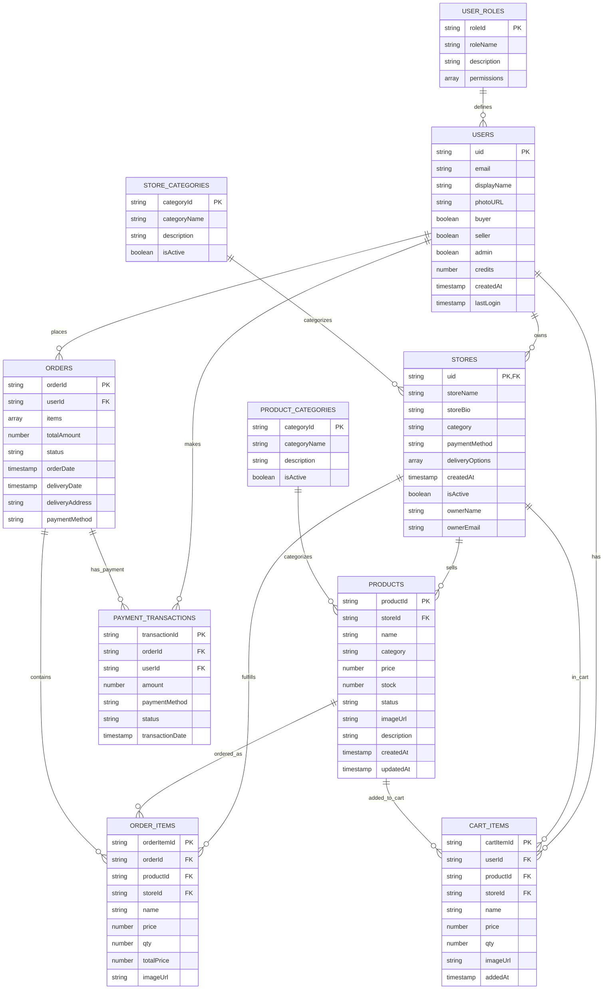

# Entity-Relationship (ER) Diagram - Artisan Marketplace

## Entity-Relationship Diagram Description:

### **Core Entities:**

#### **1. USERS Entity:**
- **Primary Key**: `uid` (Firebase Auth UID)
- **Attributes**: Basic user information, role flags, credit balance
- **Relationships**: One-to-many with stores, orders, cart items, and payments

#### **2. STORES Entity:**
- **Primary Key**: `uid` (references USERS.uid)
- **Attributes**: Store information, payment methods, delivery options
- **Relationships**: One-to-many with products, order items, and cart items

#### **3. PRODUCTS Entity:**
- **Primary Key**: `productId` (auto-generated)
- **Attributes**: Product details, pricing, inventory, status
- **Relationships**: Many-to-one with stores, one-to-many with order/cart items

#### **4. ORDERS Entity:**
- **Primary Key**: `orderId` (auto-generated)
- **Attributes**: Order summary, status, dates, delivery information
- **Relationships**: Many-to-one with users, one-to-many with order items and payments

#### **5. CART_ITEMS Entity:**
- **Primary Key**: `cartItemId` (auto-generated)
- **Attributes**: Cart item details, quantities, pricing
- **Relationships**: Many-to-one with users, products, and stores

#### **6. ORDER_ITEMS Entity:**
- **Primary Key**: `orderItemId` (auto-generated)
- **Attributes**: Individual item details within orders
- **Relationships**: Many-to-one with orders, products, and stores

### **Supporting Entities:**

#### **7. STORE_CATEGORIES & PRODUCT_CATEGORIES:**
- **Purpose**: Categorization and classification
- **Relationships**: One-to-many with stores and products respectively

#### **8. USER_ROLES:**
- **Purpose**: Role-based access control
- **Relationships**: One-to-many with users

#### **9. PAYMENT_TRANSACTIONS:**
- **Purpose**: Payment tracking and history
- **Relationships**: Many-to-one with orders and users

### **Key Relationships:**

- **User-Store**: One user can own one store (1:1)
- **Store-Products**: One store can have many products (1:N)
- **User-Orders**: One user can place many orders (1:N)
- **Order-Items**: One order can contain many items (1:N)
- **Product-Cart**: One product can be in many carts (1:N)

### **Database Design Principles:**

- **Normalization**: Proper separation of concerns
- **Referential Integrity**: Foreign key relationships maintained
- **Scalability**: Efficient querying and indexing
- **Flexibility**: Support for future feature additions

