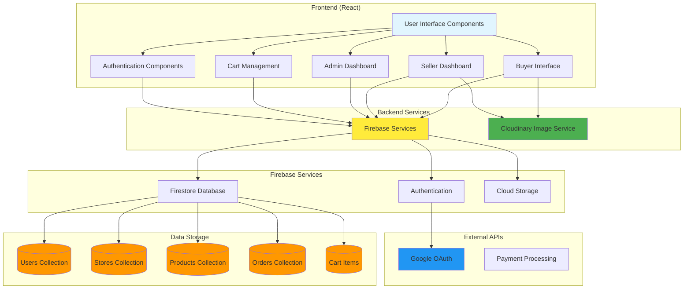

# High-Level Architecture Diagram - Artisan Marketplace

## Architecture Components Description:

### **Frontend Layer:**
- **User Interface Components**: Reusable UI elements (cards, forms, navigation)
- **Authentication Components**: Login, signup, role-based access control
- **Cart Management**: Shopping cart state and operations
- **Admin Dashboard**: User management, system oversight
- **Seller Dashboard**: Store management, inventory, sales analytics
- **Buyer Interface**: Product browsing, purchasing, order tracking

### **Backend Services:**
- **Firebase Services**: Authentication, database, storage, hosting
- **Cloudinary**: Image upload, storage, and CDN delivery

### **Data Layer:**
- **Users Collection**: User profiles, roles, credits
- **Stores Collection**: Store information, settings, metadata
- **Products Collection**: Product catalog with store relationships
- **Orders Collection**: Transaction records and order tracking
- **Cart Items**: User shopping cart data

### **External Integrations:**
- **Google OAuth**: User authentication and identity management
- **Payment Processing**: Credit-based transaction system

